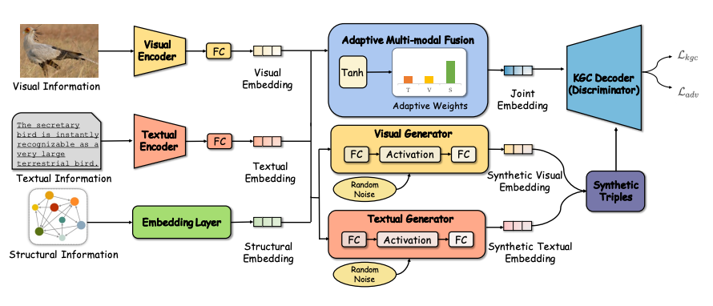

# Unleashing the Power of Imbalanced Modality Information for Multi-modal Knowledge Graph Completion


[](https://github.com/zjukg/AdaMF-MAT/main/LICENSE)
[](https://arxiv.org/abs/2402.15444)
[](https://pytorch.org/)
[](https://lrec-coling-2024.org/)
 - [Unleashing the Power of Imbalanced Modality Information for Multi-modal Knowledge Graph Completion](https://arxiv.org/abs/2402.15444)

> Multi-modal knowledge graph completion (MMKGC) aims to predict the missing triples in the multi-modal knowledge graphs by incorporating structural, visual, and textual information of entities into the discriminant models. The information from different modalities will work together to measure the triple plausibility. Existing MMKGC methods overlook the imbalance problem of modality information among entities, resulting in inadequate modal fusion and inefficient utilization of the raw modality information. To address the mentioned problems, we propose Adaptive Multi-modal Fusion and Modality Adversarial Training (AdaMF-MAT) to unleash the power of imbalanced modality information for MMKGC. AdaMF-MAT achieves multi-modal fusion with adaptive modality weights and further generates adversarial samples by modality-adversarial training to enhance the imbalanced modality information. Our approach is a co-design of the MMKGC model and training strategy which can outperform 19 recent MMKGC methods and achieve new state-of-the-art results on three public MMKGC benchmarks.

## 🌈 Model Architecture


## 💻 Data preparation
We use the MMKG datasets proposed in [MMRNS](https://github.com/quqxui/MMRNS). You can refer to this repo to download the multi-modal embeddings of the MMKGs and put them in `embeddings/`.

## 🚀 Training and Inference

You can use the shell scripts in the `scripts/` to conduct the experiments. For example, the following scripts can run an experiments on DB15K

```shell
DATA=DB15K
EMB_DIM=250
NUM_BATCH=1024
MARGIN=12
LR=1e-4
LRG=1e-4
NEG_NUM=128
EPOCH=1000

CUDA_VISIBLE_DEVICES=0 nohup python run_adamf_mat.py -dataset=$DATA \
  -batch_size=$NUM_BATCH \
  -margin=$MARGIN \
  -epoch=$EPOCH \
  -dim=$EMB_DIM \
  -lrg=$LRG \
  -mu=0 \
  -save=./checkpoint/$DATA-$NUM_BATCH-$EMB_DIM-$NEG_NUM-$MARGIN-$LR-$EPOCH \
  -neg_num=$NEG_NUM \
  -learning_rate=$LR > $DATA-$EMB_DIM-$NUM_BATCH-$NEG_NUM-$MARGIN-$EPOCH.txt &

```


## 🤝 Cite:
Please consider citing this paper if you use the code from our work.
Thanks a lot :)

```bigquery

@misc{zhang2024unleashing,
      title={Unleashing the Power of Imbalanced Modality Information for Multi-modal Knowledge Graph Completion}, 
      author={Yichi Zhang and Zhuo Chen and Lei Liang and Huajun Chen and Wen Zhang},
      year={2024},
      eprint={2402.15444},
      archivePrefix={arXiv},
      primaryClass={cs.AI}
}

```

